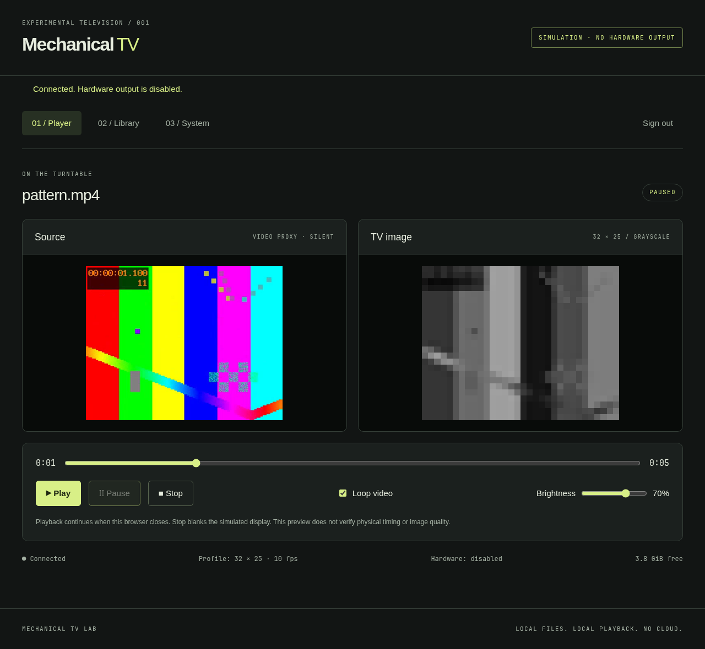

# Mechanical TV

A real-time display and synchronization appliance for a Raspberry Pi mechanical television based on [bitluni's design](https://github.com/bitluni/MechanicalTV).

**Version 0.2.0 is a Realtime First release.** It captures live HDMI video or procedural test patterns, controls a NEMA 17 stepper motor via the Adafruit Motor HAT, tracks disk synchronization using a photoelectric index sensor, and modulates 800 pixels per revolution onto a 3W LED with thermal safety watchdog protection.



## What works

- **Live HDMI Video Ingest:** Real-time capture from HDMI-to-USB/CSI capture devices (V4L2 `/dev/video0`), downscaled on the fly to 32 × 25 8-bit grayscale.
- **Procedural Test Patterns:** SMPTE grayscale bars, horizontal/vertical ramps, aperture alignment grid, rotating phase sync bar, 1 Hz photodiode pulse test, and sweeping single column.
- **Motor Control & Velocity Profiling:** Drives a NEMA 17 stepper motor using the Adafruit DC & Stepper Motor HAT (PCA9685 @ I2C 0x60, TB6612 dual H-bridge). Soft-start acceleration ramping (1.0 to 10.0+ FPS / 60 to 600+ RPM) prevents motor inertia stall.
- **Closed-Loop Optical Sync:** Photoelectric index sensor (BCM GPIO 4) detects the once-per-revolution disk notch, measuring rotation period, instantaneous RPM, jitter, and phase lock. A closed-loop PLL trims stepper intervals to eliminate drift.
- **LED Pulse Modulation:** Modulates a 3W high-power LED (BCM GPIO 21 or SPI MOSI) across 800 pixels per frame matching bitluni's Nipkow disc geometry ($x = 31 - c$, $y = 24 - r$).
- **Thermal & Stall Watchdog:** Hardware safety interlock cuts LED power immediately if motor stops, disc speed drops below 1.0 FPS, or opto pulses cease, protecting the 3D-printed disk from heat damage.
- **Optical Calibration:** Web-based phase offset slider ($0^\circ$ to $359^\circ$ / 0 to 799 px framing hold), horizontal/vertical scan inversion, optical gamma adjustment, and contrast tuning.
- **Stored Media Library:** Upload MP4/WebM/MOV videos for real-time looping or offline preview.
- **Universal Operation:** Runs on Raspberry Pi 4 Model B with physical hardware, and automatically provides high-fidelity hardware emulation when developed locally on macOS or non-Pi systems.

## Hardware setup

| Component | Specification | Connection / Notes |
| --- | --- | --- |
| **Main Computer** | Raspberry Pi 4 Model B | Raspberry Pi OS 64-bit |
| **Motor HAT** | Adafruit DC & Stepper Motor HAT | Placed on 40-pin GPIO header (I2C SDA GPIO 2, SCL GPIO 3) |
| **Stepper Motor** | STEPPERONLINE NEMA 17 (1.8°, 200 steps/rev) | Connected to Stepper 1 (terminals M1 & M2) |
| **Index Sensor** | Slotted photoelectric opto-interrupter | Signal to BCM GPIO 4 (Pin 7), GND, 3.3V |
| **LED Driver** | L298N or logic MOSFET driver | Logic input to BCM GPIO 21 (Pin 40) or SPI MOSI (Pin 19) |
| **Light Source** | 3W High-power White or RGB LED | Heat-sink mounted, driven via L298N from dedicated supply |
| **Power Supply** | Adjustable 9–12 V, 3 A supply | Connected to Adafruit Motor HAT external power terminals |
| **Video Input** | HDMI-to-USB capture device | Connected to Pi 4 USB 3.0 port (`/dev/video0`) |

> [!WARNING]
> Keep the Raspberry Pi on its dedicated official 5V/3A USB-C supply. Do not power the Pi from the motor supply. Always heatsink the 3W LED.

## Start on a development computer

Requires Python **3.11+**, FFmpeg and FFprobe. Runs in emulation mode without physical I2C/GPIO:

```bash
git clone https://github.com/andrewfrangella/mechanicaltv.git
cd mechanicaltv
python3 -m mechanical_tv.server init --data ./data
python3 -m mechanical_tv.server serve --data ./data --mock-hardware
```

Open **http://127.0.0.1:8080** and sign in using the application password you just created.

## Install on Raspberry Pi OS

Use Raspberry Pi OS 64-bit (Debian Bookworm or Bullseye):

```bash
sudo apt update
sudo apt install -y git
git clone https://github.com/andrewfrangella/mechanicaltv.git
cd mechanicaltv
sudo bash install.sh
```

The installer installs hardware packages (`i2c-tools`, `python3-smbus`, `v4l-utils`), adds the service user to `i2c`, `gpio`, and `video` groups, enables I2C, and starts the systemd service.

Open `http://<Pi-IP-address>:8080` or `http://mechanical-tv.local:8080`.

## Documentation

| Document | Contents |
| --- | --- |
| [Hardware Guide](docs/HARDWARE.md) | Verified wiring diagram, Adafruit Motor HAT pinout, NEMA 17 connection, opto timing, and safety |
| [Architecture](docs/ARCHITECTURE.md) | Real-time synchronization loop, video capture pipeline, Nipkow coordinate mapping, and threading |
| [Project Plan](docs/PROJECT_PLAN.md) | Hardware bring-up status, synchronization milestones, and roadmap |
| [User Guide](docs/USER_GUIDE.md) | Realtime studio controls, optical calibration, test patterns, and troubleshooting |
| [Installation](docs/INSTALL.md) | Pi OS setup, hotspot configuration, systemd permissions, and recovery |
| [Validation](docs/VALIDATION.md) | Test commands, test pattern verification, and physical bring-up checklist |

## Tests

```bash
python3 -m unittest discover -s tests -v
bash -n install.sh packaging/make-test-clip.sh
node --check mechanical_tv/static/app.js
```

## Attribution and licensing

Based on the mechanical television concept and geometry by [bitluni](https://github.com/bitluni/MechanicalTV). This repository contains independently developed real-time Python/Linux software for Raspberry Pi 4, Adafruit Motor HAT, and HDMI video ingest.
