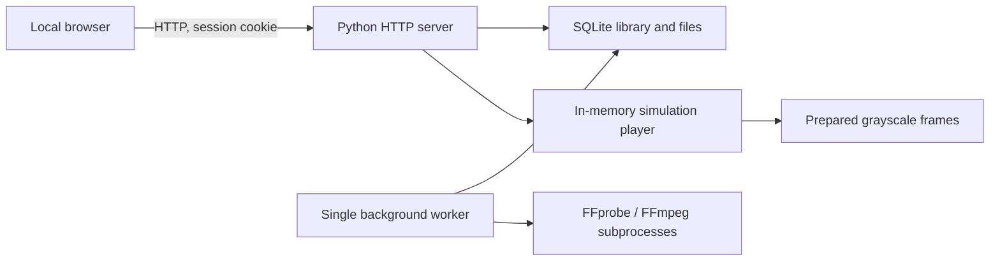

# Architecture and developer notes

## Runtime



Version 0.1.0 has one systemd service. Web requests are handled in threads, a worker thread schedules one conversion at a time, and FFmpeg does CPU-heavy conversion in separate processes. A thread lock protects playback state, each short database operation has a separate closed connection/transaction, and the browser polls the authoritative player.

This is a deliberate reduction from the initial three-service concept. It makes the first Pi installation smaller, but a whole-process failure also interrupts the player. Splitting the real output controller into a separate supervised process remains an appropriate next step when hardware work begins.

## Video pipeline

1. Authenticate and validate a fixed upload length. Enforce size, disk reserve, queue, and single-upload limits.
2. Write `upload.part` under a UUID directory. On successful completion, rename to `original` and queue it.
3. FFprobe validates stream presence, dimensions, and duration. Only MOV/MP4, Matroska/WebM and AVI demuxers and the local `file` protocol are allowed.
4. FFmpeg normalizes to 10 fps, fits/pads or center-crops to 32 × 25, and emits gray8 frames.
5. A second FFmpeg pass creates a silent, H.264/yuv420p, fast-start MP4 proxy, bounded to 480 pixels per side.
6. Validate frame length/count; rename temporary outputs and record profile metadata before marking ready.

Conversions have timeouts and use limited thread counts. The systemd service also has memory/task/CPU limits. These are resource controls, not proof that arbitrary untrusted media is safe; keep the Pi's FFmpeg/security packages maintained and restrict users to the intended local group.

## Storage

```text
/var/lib/mechanical-tv/
  auth.json                 # Salted password hash, mode 0600
  media/
    library.sqlite3
    <uuid>/
      original
      preview.mp4
      frames.raw
      profile.json
  backups/                  # Installer database backups, not complete media backups
```

`frames.raw`: each consecutive frame is 800 unsigned bytes, row-major left-to-right, top-to-bottom. Zero is black, 255 is white. There is no header. `profile.json` supplies width, height, fps, frame count, framing, format and version. This is an image representation, **not an electrical waveform or bitluni wire protocol**. A future driver must map pixels to physical scan order, phase and blanking.

The database stores generated ID, display name, status, prepared duration, frame count, framing, error and creation time. User settings such as loop/brightness and selected clip are intentionally reset on process restart in this release.

## Playback

The player loads at most 4.8 MB of prepared data for a ten-minute clip. A monotonic clock determines position. Snapshots and commands advance elapsed time, avoiding accumulation of browser timer drift. There is no continuously toggled GPIO and no real-time output thread. With no browser polling, the next snapshot still computes the correct elapsed position; this is logical simulation, not unattended physical rendering.

Pause freezes position. Stop resets and blanks. Seeking clamps to a valid frame. Loop wraps at the prepared duration. The source proxy is synchronized approximately in the browser; it is not an audio/video synchronization guarantee. Status polling is slower than the prepared frame rate, so some preview frames are skipped by design.

## HTTP API

All `/api/*` routes except login require a session. POST requests require `X-MTV-Request: 1`; cross-origin browser requests are not supported. JSON bodies are limited to 4096 bytes. Upload body is raw file bytes, not multipart.

| Method and route | Input / output |
| --- | --- |
| GET `/healthz` | Public minimal HTTP liveness and simulation mode |
| POST `/api/login` | `{ "password": "..." }`; sets HttpOnly/SameSite cookie |
| POST `/api/logout` | `{}`; invalidates session |
| GET `/api/state` | Player state/pixels and library entries |
| POST `/api/upload?name=clip.mp4&fit=fit` | Raw bytes with Content-Length; queues media |
| POST `/api/player` | `{ "action": "select", "value": "<id>" }` or play/pause/stop/seek/brightness/loop |
| POST `/api/delete` | `{ "id": "<id>" }`; no deletion of active conversion or playing clip |
| GET `/api/preview/<id>` | Authenticated MP4 proxy with single byte-range support |
| GET `/api/health` | Dependencies, worker, storage, uptime, mode |
| GET `/api/diagnostics` | Downloadable sanitized health JSON |

Sessions last 12 hours and are invalidated by restart. Login attempts are globally limited to ten per minute and concurrent sessions to 32. The server binds to loopback in development and all interfaces in the provided appliance configuration.

## Boundaries

- Trusted LAN/hotspot deployment only. HTTP has no transport encryption. Do not reuse a valuable account password here, expose the service publicly, or assume session cookies secure it against network observers.
- No privileged web actions. The service user cannot reconfigure Wi-Fi, install packages, shut down the OS, or access GPIO devices through the supplied systemd unit.
- Static assets are local; restrictive CSP, no third-party scripts, no analytics, no CORS.
- Fixed asset routes and validated UUID media paths; names render through `textContent`.
- The Python stdlib server is intentionally small and has not been load-tested or hardened as a public internet server.
- Physical loss-of-sync protection, watchdogs, timing accuracy and emergency stop need hardware-specific design and validation.

## Extending output later

Keep video preparation and UI independent of motor hardware. Introduce an output adapter that accepts prepared image frames and commands and reports measured state. Simulation, direct Pi output, and a Pi-to-microcontroller link can then share the media library. Do not claim a requested speed is a measured speed or map source fps directly to safe motor RPM without validating the disk.
