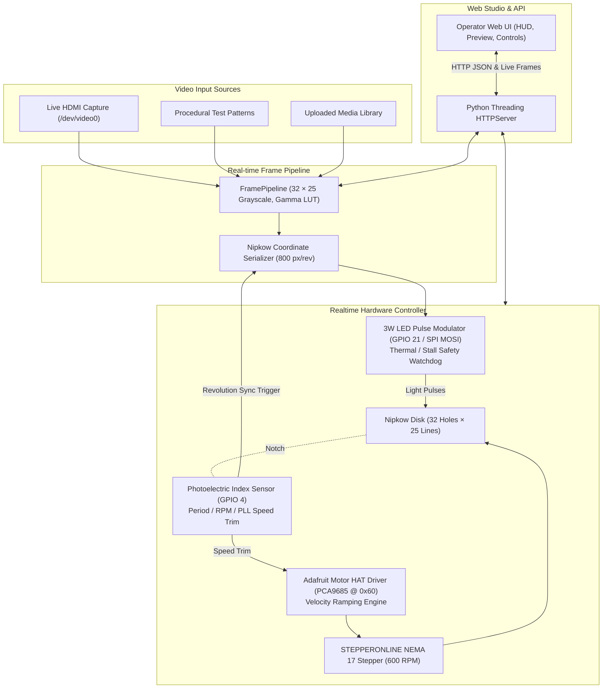

# Architecture and Realtime Synchronization

## Runtime Architecture

---

## 1. Video Pipeline

1. **Ingest Modes:**
   - **Live HDMI Capture:** Low-latency acquisition via V4L2 device (`/dev/video0`) using OpenCV VideoCapture or direct FFmpeg raw pipe.
   - **Procedural Test Patterns:** Algorithmic patterns generated at target frame rate without external files (SMPTE grayscale bars, horizontal/vertical ramps, alignment grid with crosshair, rotating phase sync bar, 1 Hz photodiode pulse test).
   - **Media Library:** Looping prepared 32 × 25 grayscale video files.
2. **Normalization:**
   - Downscaled to exactly 32 columns by 25 rows (800 bytes per frame).
   - Formatted as 8-bit unsigned grayscale ($0 = \text{black}$, $255 = \text{white}$).
   - Optical gamma correction applied via a precomputed 256-byte lookup table ($\gamma = 1.8$ default).
   - Master brightness and contrast scaling applied.
3. **Nipkow Coordinate Serialization:**
   - Bitluni Archimedean spiral formula maps row-major raster images to the sequential light pulses corresponding to the 32 holes:
     $$\text{For pixel index } i \in [0, 799]:$$
     $$\text{Column } c = i // 25, \quad \text{Line } r = i \% 25$$
     $$x = 31 - c \quad (\text{or } c \text{ if invert\_x}), \quad y = 24 - r \quad (\text{or } r \text{ if invert\_y})$$
     $$\text{Shifted } i' = (i + \text{phase\_offset}) \pmod{800}$$
   - Pre-computed 800-entry coordinate mapping executes in $< 5\ \mu\text{s}$ per frame.

---

## 2. Motor & Speed Control

- **Driver:** Adafruit DC & Stepper Motor HAT (Mini Kit) featuring the PCA9685 16-channel 12-bit PWM controller communicating over I2C at address `0x60`, driving dual TB6612 H-bridge motor drivers.
- **Motor:** STEPPERONLINE 17HE08-1004S NEMA 17 bipolar stepper motor (1.8° step angle, 200 full steps per revolution).
- **Stepping Strategy:** 8-step half-step (interleave) commutation produces 400 half-steps per revolution, reducing mechanical resonance and vibration compared to full-stepping.
- **Velocity Profiling (Acceleration Ramp):**
  - Sudden acceleration stalls stepper motors due to disk inertia.
  - The controller initiates rotation at a soft start speed of 1.0 FPS (60 RPM) and ramps speed up by `2.0 FPS/s` until reaching the target speed (default 10.0 FPS / 600 RPM).
- **Power Management:** On motor stop, `release()` writes 0 to all PWM channels, de-energizing the coils to prevent idle heating.

---

## 3. Optical Index Feedback & PLL Sync

- **Sensor:** Photoelectric optical interrupter mounted to detect a sync slot on the outer rim of the Nipkow disk once per revolution.
- **Interrupt / Edge Processing:**
  - Connected to BCM GPIO 4 (physical pin 7).
  - High-resolution timestamping via `time.perf_counter()` on rising edges.
  - Measures instantaneous revolution period $\Delta t$.
  - Computes instantaneous and moving-average RPM ($60.0 / \Delta t$) and FPS ($1.0 / \Delta t$).
  - Jitter measurement: standard deviation between target period and measured period.
- **Sync Lock:**
  - When measured FPS is within $\pm 3\%$ of target FPS and jitter is $< 2.0\text{ ms}$ across 5 consecutive revolutions, `sync_locked` is asserted.
- **Closed-Loop Speed Trim (PLL):**
  - Period error $e_p = T_{target} - T_{measured}$.
  - Proportional adjustment trims the microsecond step delay: $\Delta \tau = K_p \times e_p$.

---

## 4. LED Pulse Modulator & Safety Interlock

- **Light Source:** 3W high-power white LED switched via L298N dual H-bridge from BCM GPIO 21 (or SPI MOSI Pin 19).
- **Pixel Modulation:**
  - At 10.0 FPS, 1 revolution takes 100 ms.
  - 800 pixels per revolution means each pixel occupies a $125.0\ \mu\text{s}$ timeslot.
  - Within each $125\ \mu\text{s}$ window, the LED is pulsed HIGH for duration:
    $$t_{on} = 125.0\ \mu\text{s} \times \left(\frac{V_{pixel}}{255}\right) \times \text{Master Brightness}$$
- **Zero-Jitter SPI Output Mode (Optional):**
  - Uses Raspberry Pi hardware SPI MOSI (`/dev/spidev0.0`) via DMA at 2.0 MHz.
  - Generates exact hardware bitstreams without software timing jitter.
- **Thermal & Stall Safety Watchdog:**
  - The optical index callback feeds a watchdog timer every revolution.
  - If no index pulse is received within 350 ms, or if motor speed is $< 1.0\text{ FPS}$:
    - The safety interlock trips immediately.
    - LED output is forced LOW (`blank()`).
    - Protects the 3D-printed PLA disk and 3W LED from thermal burnout.

---

## 5. HTTP API

| Method & Route | Description |
| --- | --- |
| `GET /healthz` | Public liveness probe and operation mode |
| `POST /api/login` | Authenticate with application password |
| `POST /api/logout` | Terminate session |
| `GET /api/state` | Unified state: Player snapshot, Library items, Realtime telemetry |
| `GET /api/realtime/status` | Comprehensive hardware status (RPM, Target, Lock, Jitter, Watchdog, LED Duty) |
| `POST /api/realtime/control` | Hardware control commands (`start`, `stop`, `emergency_blank`, `speed`, `source`, `pattern`, `calibration`) |
| `GET /api/realtime/frame` | Live 32 × 25 frame payload (800 bytes) for web canvas monitor |
| `POST /api/upload` | Upload video file for background preparation |
| `POST /api/player` | Media player commands (`play`, `pause`, `stop`, `seek`, `loop`, `brightness`) |
| `POST /api/delete` | Delete prepared media clip |
| `GET /api/preview/<id>` | Authenticated MP4 proxy preview stream |
| `GET /api/health` | Hardware components, Pi temperature, storage, CPU load |
| `GET /api/diagnostics` | Downloadable sanitized diagnostics JSON report |
